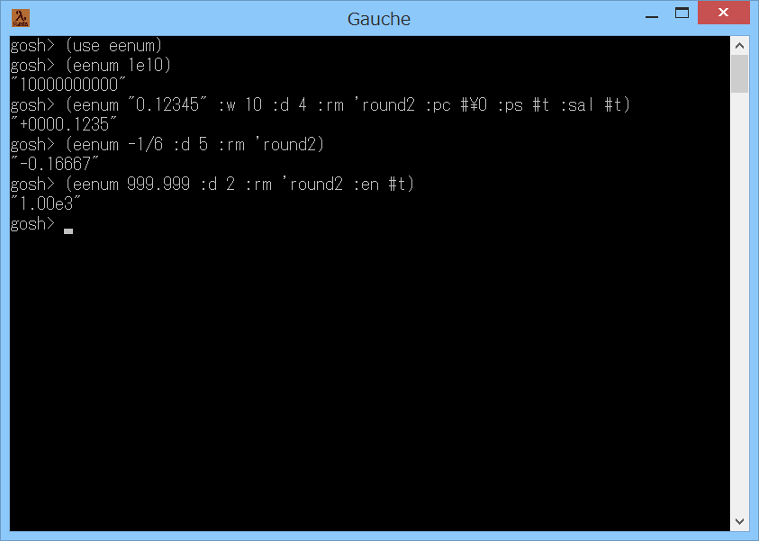

# eenum



## 概要
- Gauche で、数値の指数表記を展開した文字列を取得するためのモジュールです。  
  また、桁数を指定して丸め処理を行った文字列を取得することもできます。


## インストール方法
- eenum.scm を Gauche でロード可能なフォルダにコピーします。  
  (例えば (gauche-site-library-directory) で表示されるフォルダ等)


## 使い方
- 以下を実行します。
  ```
    (use eenum)
  ```
  以後、(eenum 1e10) 等で数値の指数表記を展開できます。

- eenum 手続きの書式は以下の通りです。  
  ```
  (eenum num [:w width] [:d digits] [:rm round-mode] [:pc pad-char]
             [:ps plus-sign] [:sal sign-align-left] [:cd circular-digits]
             [:en exponential-notation] [:ed exponential-digits])
  ```
  - 第1引数の num には、数値または数値の文字列を指定します。  
    この値を入力として、指数表記を展開した文字列を生成して出力します。  
    (ただし、キーワード引数 :en を指定した場合には、指数表記の文字列を出力します)

  - (これ以降のキーワード引数は、すべて出力についての指定になります)

  - キーワード引数 :w の width には、全体の文字数を指定します。  
    結果がこの文字数未満であれば、後述の pad-char を挿入して右寄せにして出力します。  
    結果がこの文字数以上の場合には、そのまま出力します。  
    このキーワード引数を指定しなかった場合には、  
    文字数によらず、結果をそのまま出力します。

  - キーワード引数 :d の digits には、小数点以下の桁数を指定します。  
    結果の小数部がこの桁数より多い場合には、丸め処理を行います。  
    結果の小数部がこの桁数より少ない場合には、0 を追加します。  
    もし、このキーワード引数に負の数を指定した場合には、整数部の丸め処理を行います。  
    また、このキーワード引数を指定しなかった場合には、  
    結果をそのまま出力します(丸め処理を行いません)。

  - キーワード引数 :rm の round-mode には、丸めモードを指定します。  
    以下のモードを指定できます。
    ```
    'truncate  ゼロへの丸め       (ゼロ方向への切り捨て)
    'floor     負の無限大への丸め (越えない最大の整数への丸め)
    'ceiling   正の無限大への丸め (下回らない最小の整数への丸め)
    'round     最近接偶数への丸め (最も近い整数へ丸める。ちょうど 0.5 のときは偶数に丸める)
    'round2    四捨五入
    ```
    現状、'round と 'round2 は、負の数のときは、絶対値部分に対して丸めを行います。  
    ( -1.27 → -1.3 等 )  
    このキーワード引数を指定しなかった場合には、'truncate を指定したことになります。

  - キーワード引数 :pc の pad-char には、右寄せ時に挿入するパッド文字を指定します。  
    このキーワード引数を指定しなかった場合には、`#\space` を指定したことになります。

  - キーワード引数 :ps の plus-sign には、正符号(+)を出力するかどうかを指定します。  
    `#t` を指定すると、正符号を出力します。  
    `#f` を指定すると、正符号を出力しません。  
    このキーワード引数を指定しなかった場合には、#f を指定したことになります。

  - キーワード引数 :sal の sign-align-left には、符号を左寄せで出力するかどうかを指定します。  
    `#t` を指定すると、符号を左寄せで出力します。  
    (すなわち、符号を pad-char よりも左に出力します)  
    `#f` を指定すると、符号を左寄せにはしません。  
    (すなわち、符号を pad-char よりも右に出力します)  
    このキーワード引数を指定しなかった場合には、#f を指定したことになります。

  - キーワード引数 :cd の circular-digits には、循環小数の最大桁数を指定します。  
    num に有理数 (1/7 等) を指定した場合、循環小数に展開しますが、  
    ここで指定した桁数までで展開を止めます。  
    このキーワード引数を指定しなかった場合には、100 を指定したことになります。  
    また、設定可能な最大値は 1000000 までです。

  - キーワード引数 :en の exponential-notation には、指数表記で出力を行うかどうかを指定します。  
    `#t` を指定すると、指数表記で出力を行います。  
    ただし、出力が 0 もしくは 指数部が 0 の場合には、指数部の表示は省略されます。  
    もし、常に指数部を表示したい場合には、'always を指定してください。  
    `#f` を指定すると、指数表記での出力は行いません。  
    このキーワード引数を指定しなかった場合には、#f を指定したことになります。

  - キーワード引数 :ed の exponential-digits には、指数表記の整数部の桁数を指定します。  
    例えば、3 を指定すると、123.45e-2 のように、整数部を 3 桁にして表示します。  
    このキーワード引数を指定しなかった場合には、1 を指定したことになります。


## 注意事項
1. 文字列操作で指数表記の展開や丸め処理を行うため、その分の時間がかかります。

2. 複素数 (1+2i や 1@2 等) には未対応です。

3. 数値の接頭辞 (#b #d #e #i #o #x) で開始する文字列には未対応です。

4. 分数表記の文字列 ("1/100" 等) には未対応です。

5. 文字列の最大長の制限が存在します。  
   例えば、Windows 環境では、(eenum "1e536870912") はエラーになります。


## その他 ノウハウ等
1. 丸めの誤差について  
   内部形式が2進数の小数と、10進数の小数とでは、表現できる数が異なるため、  
   誤差が発生するケースがあります。例えば、  
   
   ```
   ;; 数値xを偶数丸めして小数第n位までの数値にする
   (define (round-n x n)
     (let1 p (expt 10 n)
       (/. (round (* x p)) p)))
   ```
   という手続きを定義して、(round-n 5.015 2) を計算した場合、  
   結果は 5.02 になるはずですが、実際には 5.01 になります。  
   これは、5.015 が (内部形式である) 2進数では正確に表現できず 5.014999 ... となり、  
   その後の 100 の乗算および除算での誤差も加わって、このような結果となったものです。  
   (計算の過程で、誤差が見えなくなるケースもあります。  
    例えば、(round-n 0.015 2) の結果は 0.02 になります)  
   本モジュールでは、丸めの計算に文字列操作と整数の加算を用いることで、  
   このような誤差が生じないようにしています。  
   (そのかわり、計算のコストはかなり増加しています)

2. SRFI-48 の format について  
   SRFI-48 の format にも小数点以下の桁数を指定して丸める機能があります。  
   ただし、大きい数や小さい数が指数表記になるかどうかは、処理系依存とのことです。  
   また、参照実装のソースには、バグがあるようです。(2017-10-24 確認)  
   ( → 既知のバグについては、プルリクエストを送信しました。(2017-10-26 ～ 2017-11-7)  
   https://github.com/scheme-requests-for-implementation/srfi-48/pulls?utf8=%E2%9C%93&q=is%3Apr )


## 参考情報
1. 2進小数の10進桁での丸め  
   http://blog.practical-scheme.net/shiro/20131229-flonum-rounding

2. RubyとPythonとC#のround関数のバグっぽい挙動について  
   http://d.hatena.ne.jp/hnw/20131229

3. SRFI-48  
   http://srfi.schemers.org/srfi-48/srfi-48.html


## 環境等
- OS
  - Windows 8.1 (64bit)
- 言語
  - Gauche v0.9.8
  - Gauche v0.9.7
  - Gauche v0.9.6
  - Gauche v0.9.5
  - Gauche v0.9.4

## 履歴
- 2016-5-15  v1.00 (初版)
- 2016-5-15  v1.01 先頭のゼロのスキップ処理修正  
  pad-char 引数追加
- 2016-5-15  v1.02 数値が不完全なときのエラーチェック追加  
  指数の分だけシフトした後の先頭のゼロを削除
- 2016-5-16  v1.03 数値が不完全なときのエラーチェック追加  
  小数点以下の桁数指定時の処理見直し
- 2016-5-16  v1.04 丸めモードの引数追加
- 2016-5-16  v1.05 コメント修正のみ
- 2016-5-28  v1.06 sign-align-left 引数追加  
  引数の順番見直し(過去との互換性なし)
- 2016-6-6   v1.07 内部処理の分割見直し等(%shift-num-str,%round-num-str-sub)
- 2016-6-13  v1.08 内部処理の分割見直し等(%remove-leading-zero,%pad-num-str)
- 2016-6-13  v1.09 書式修正のみ
- 2016-10-26 v1.10 整数でない数値を渡した場合には、不正確数に変換してから処理
- 2016-10-27 v1.11 コメント修正等
- 2017-1-3   v1.12 有理数を循環小数に展開する処理を追加
- 2017-1-3   v1.13 コメント修正等
- 2017-1-4   v1.14 第8引数の仕様見直し(他の引数に合わせた)
- 2017-1-5   v1.20 num以外の引数をキーワード引数に変更(過去との互換性なし)
- 2017-1-6   v1.21 循環小数の最大桁数のエラーチェック追加
- 2017-1-10  v1.22 コメント修正のみ
- 2017-10-24 v1.23 数値文字列変換処理見直し等
- 2017-10-25 v1.24 文字列処理一部見直し
- 2017-10-31 v1.30 キーワード引数 :en を追加
- 2018-7-8   v1.30 README修正のみ(Gauche v0.9.6 で動作確認)
- 2019-10-23 v1.31 コメント修正等
- 2019-10-25 v1.32 キーワード引数 :ed を追加し :en の意味を変更(過去との互換性なし)
- 2019-10-28 v1.33 有理数の展開処理見直し


(2019-10-31)
